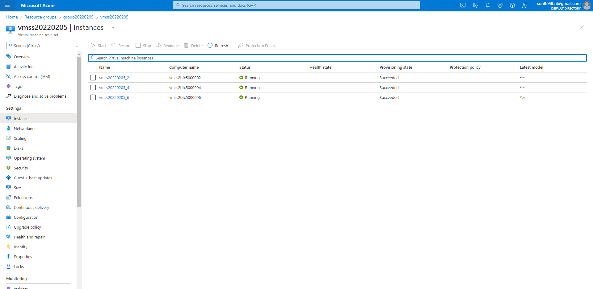

# Enhancing Applications

## Project Overview
With a combination of cloud technologies, such as Azure Kubernetes Service, VM Scale Sets, Application Insights, Azure Log Analytics, and Azure Runbooks, I collected and displayed performance and health data about an application, and implemented automated remediation tasks. The project showcased my skills in diagnosing and rectifying application and infrastructure problems. Below are the project steps:
- Setup Application Insights monitoring on a VMSS and implement monitoring in an application to collect telemetry data
- Setup an auto-scaling for a VMSS
- Setup a VMSS alert and create a RunBook to automate the resolution of performance issues
- Create alerts to trigger auto-scaling on an AKS cluster and trigger a RunBook to execute

## Dependencies
1. [Azure Account](https://azure.microsoft.com/en-us/free/)
2. [Azure DevOps account](https://azure.microsoft.com/en-us/pricing/details/devops/azure-devops-services/) (Click **Start Free** under **Azure Pipelines**)
3. [VS Code or your preferred editor](https://code.visualstudio.com/Download) Install the VS Code extensions for Python (optional)
4. [Azure CLI](https://docs.microsoft.com/en-us/cli/azure/install-azure-cli?view=azure-cli-latest)
5. Redis
   - [Redis—Non-Windows Download](https://redis.io/download)
   - [Redis—Windows Download](https://riptutorial.com/redis/example/29962/installing-and-running-redis-server-on-windows)
   - [Redis Quick Start](https://redis.io/topics/quickstart)

## Deploy the webapp in Azure
1. Log in to Azure using `az login`. Run `./vmss.sh` in the terminal. Check the Public IP address. 
   ```
   az vmss list-instance-connection-info \
   --resource-group group20220205 \
   --name vmss20220205
   ```
2. Connect to the VM. 
   ```
   ssh -p [port] admin20220205@[public-ip]
   ```
3. Clone project and deploy manually.

## Application Insights & Log Analytics
1. Create an Application Insights resource with the Log Analytics workspace
2. Enable Application Insights monitoring for the VM Scale Set

3. Add the instrumentation key of Application Insights to `main.py` 
5. View custom event telemetry when 'Dogs' is clicked and when 'Cats' is clicked.

6. Create a query to view the event telemetry in Log Analytics.

7. Create a chart from query showing when 'Dogs' or 'Cats' is clicked.


## Autoscaling
1. For the VM Scale Set, create an autoscaling rule based on metrics.

2. Trigger the conditions for the rule, causing an autoscaling event.

3. When complete, enable manual scale.

### Runbook
1. Create an alert which uses a runbook to remedy a problem.


## Monitoring Containers
1. Run `az login` to login, then run `./cluster.sh` to create an AKS cluster and deploy a container to it.
2. Once that is completed, go to Insights for the cluster.
3. Observe the state of the cluster. Note the number of nodes and number of containers.

4. Create an alert in Azure Monitor to trigger when the number of pods increases over a certain threshold.

5. Create an autoscaler by using the following Azure CLI command—`kubectl autoscale deployment azure-vote-front --cpu-percent=70 --min=1 --max=10`
